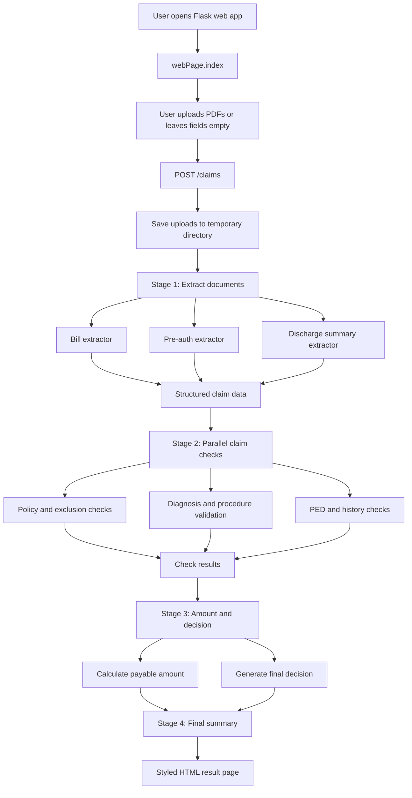

# GenAI-powered Health Insurance Claim Processing

An AI-powered Flask web application for automating health insurance claim processing using OCR, Generative AI, and parallel processing pipelines.
The system extracts structured information from hospital bills, pre-auth forms, and discharge summaries, then performs policy validation, medical checks, PED/history analysis, and claim amount calculation.
Built with Python, Flask, PyPDF, OCR workflows, and LLM-based reasoning to enable faster, scalable, and automated insurance claim review.
Policy Handbook and Rules: Niva Bupa

## What This Project Does

This project automates a basic insurance claim review workflow using:

- Hospital bill PDF extraction
- Pre-authorization form extraction
- Discharge summary extraction
- Policy and exclusion checks
- Diagnosis and procedure validation
- PED and claim history checks
- Claim amount calculation
- Final approval decision generation
- Final claim summary generation

## Features

- Upload three claim PDFs from a browser:
  - Hospital bill
  - Pre-auth form
  - Discharge summary
- Run bundled sample documents when uploads are left empty
- Show live staged progress while the backend is working
- Stop each loader when its stage completes
- Render a styled final result page
- Provide both HTML and JSON routes
- Run expensive document and claim checks in parallel where possible

## Project Structure

```text
Parallel_Insurance_Claim_Approver_WEBAPP/
├── app.py
├── mainInsuranceClaimParallel.py
├── webPage.index
├── config.yaml
├── requirements.txt
└── utils/
    ├── Approval/
    │   ├── approvalRun.py
    │   └── claimSummary.py
    ├── Bills/
    │   ├── bill_extractor.py
    │   └── sample bill PDFs
    ├── Final_Pre_Auth/
    │   ├── preauthinfo_extractor.py
    │   └── sample pre-auth PDFs
    ├── Discharge_Summaries/
    │   ├── discharge_summary_extractor.py
    │   └── sample discharge PDFs
    ├── PolicyProcedure/
    │   ├── rule_checks.py
    │   ├── runProcedureValidity.py
    │   ├── Insurance_Customers_DataBase.csv
    │   └── ExcludedHospitalsFinal.csv
    └── checkPED/
        ├── diseasePEDchecker.py
        ├── Medical_History_Final.csv
        └── Historical_Claims_Final.csv
```

## Architecture




## Backend Flow

### 1. User opens the app

The root route serves the UI from `webPage.index`.

```python
@app.get("/")
def index():
    return Response((BASE_DIR / "webPage.index").read_text(encoding="utf-8"), mimetype="text/html")
```

### 2. User submits claim documents

The HTML form submits to:

```text
POST /claims
```

Expected form field names:

```text
bill
pre_auth
discharge_summary
```

If a field is left empty, the backend uses the bundled sample document path from `mainInsuranceClaimParallel.py`.

### 3. Flask streams progress

The `/claims` route returns a streaming HTML response. This allows the browser to receive progress updates as each stage completes.

Stages shown to the user:

1. Extracting claim documents
2. Running policy and medical checks
3. Calculating amount and decision
4. Generating final summary

### 4. Pipeline runs in stages

The core pipeline is in `mainInsuranceClaimParallel.py`.

Important functions:

- `process_documents(...)`
- `run_claim_pipeline(...)`
- `run_full_claim_pipeline(...)`

The web app uses the same processing logic but streams UI updates between stages.

### 5. Final result is rendered

After all stages complete, Flask renders a styled result page with:

- Final decision
- Final payable amount
- Total deduction
- Risk flags
- Claim summary


### Main App Interface


### Results Interface


## Routes

| Route | Method | Purpose |
| --- | --- | --- |
| `/` | GET | Serves the main upload page from `webPage.index` |
| `/claims` | POST | Runs the claim pipeline and streams staged HTML progress |
| `/api/claims` | POST | Runs the claim pipeline and returns JSON |
| `/health` | GET | Health check route |

## Setup

### 1. Clone the repository

```bash
git clone <your-repo-url>
cd Parallel_Insurance_Claim_Approver_WEBAPP
```

### 2. Create or activate a Python environment

Example with conda:

```bash
conda create -n Insurance python=3.10
conda activate Insurance
```

If you already have the environment:

```bash
conda activate Insurance
```

### 3. Install dependencies

```bash
pip install -r requirements.txt
```

### 4. Configure the OpenAI API key

The app reads the API key from either:

1. Environment variable:

```bash
set OPENAI_API_KEY=your_api_key_here
```

2. Or `config.yaml`:

```yaml
OPENAI_API_KEY: your_api_key_here
```

For GitHub, avoid committing real API keys.

### 5. Run the app

```bash
python app.py
```

Then open:

```text
http://127.0.0.1:5000/
```

## How To Use

1. Open the app in the browser.
2. Upload:
   - Hospital bill PDF
   - Pre-auth PDF
   - Discharge summary PDF
3. Click `Run Claim Review`.
4. Watch each backend stage move from running to done.
5. Review the final claim decision and summary.

To test with bundled sample files, leave the upload fields empty and submit the form.

## Default Sample Inputs

These defaults are defined in `mainInsuranceClaimParallel.py`:

```python
DEFAULT_BILL_PATH = "utils/Bills/PSG_Hospital_Bill_One_Page.pdf"
DEFAULT_PRE_AUTH_FORM_PATH = "utils/Final_Pre_Auth/DharneshPreAu.pdf"
DEFAULT_DISCHARGE_SUMMARY_PATH = "utils/Discharge_Summaries/pdfcoffee.com_discharge-summary-3-pdf-free.pdf"
DEFAULT_INSURANCE_PATH = "utils/PolicyProcedure/Insurance_Customers_DataBase.csv"
DEFAULT_EXCLUSIONS_PATH = "utils/PolicyProcedure/ExcludedHospitalsFinal.csv"
DEFAULT_MEDICAL_HISTORY_PATH = "utils/checkPED/Medical_History_Final.csv"
DEFAULT_HISTORY_CLAIMS_PATH = "utils/checkPED/Historical_Claims_Final.csv"
```

## Processing Stages

### Stage 1: Document Extraction

Runs the bill, pre-auth, and discharge summary extraction in parallel.

Output:

- Structured bill data
- Structured pre-auth data
- Structured discharge summary data

### Stage 2: Claim Checks

Runs these checks in parallel:

- Claim rule checks
- Diagnosis and procedure validation
- PED and historical claim checks

Output:

- Claim check results
- Diagnosis/procedure results
- PED results

### Stage 3: Amount and Decision

Calculates:

- Final payable amount
- Total deduction
- Final claim decision
- Risk flags

### Stage 4: Final Summary

Generates a human-readable claim summary using the extracted data, checks, amount calculation, and final decision.

## JSON API Usage

The `/api/claims` endpoint accepts the same form fields as `/claims`, but returns JSON instead of HTML.

Example:

```bash
curl -X POST http://127.0.0.1:5000/api/claims ^
  -F "bill=@path/to/bill.pdf" ^
  -F "pre_auth=@path/to/preauth.pdf" ^
  -F "discharge_summary=@path/to/discharge.pdf"
```

## Tech Stack

- Python
- Flask
- OpenAI API
- pandas
- PyPDF2
- pdf2image
- pytesseract
- PyYAML

